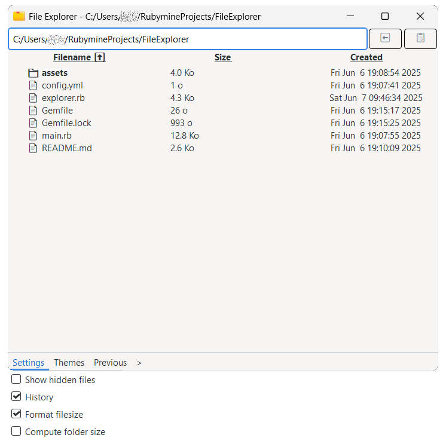

# File Explorer

This application is a simple file explorer made in Ruby. It relies on GTK3 for the graphical interface.

> [!NOTE]
> This project has been made to learn the Ruby programming language. The code may not follow the best convention and 
> this software should probably not be used in any serious activity.

## Requirements

The project is built with Ruby:
- [Ruby 3.3.8](https://www.ruby-lang.org/en/downloads/)
- [GTK-3](https://docs.gtk.org/gtk3/)


## How to run this project ?

The first step is to install Ruby : see the [official website](https://www.ruby-lang.org/en/downloads/).

Then use the `gem` command to install GTK 3:
```shell
gem install gtk3
```

Finally, the application can be executed with the following command:
```shell
ruby main.rb
```


## Project structure

- [`main.rb`](main.rb): Entrypoint for the application. Contains the code description of the UI
- [`explorer.rb`](explorer.rb): The file explorer class and methods
- [`Gemfile`](Gemfile): The file that contains the project dependencies
- [`config.yml`](config.yml): Configuration option for the file explorer
- [`README.md`](README.md): The current file you are reading, detailing the project
- [`assets`](assets): A folder containing the project resources (i.e. icon, css stylesheet, font...) 


## Images

Here is the current look of the application:


## Features

Here is a list of features that are supported by this application
- [x] Enumerates files and folder
- [ ] Navigation between directories
  - [x] Search bar
  - [ ] Previous/ Next button
  - [ ] History
  - [x] Click to explore a file directory
  - [x] Copy current path to clipboard (from search bar)
- [x] Formating file size to be more humanly-readable
- [x] Displaying hidden files
- [ ] Selecting information to display via toggle (size, type, creation date...)
- [ ] Advanced file option
  - [ ] Copy file path to clipboard
  - [ ] Copy file name to clipboard
- [ ] Icon next to filename
- [x] Sort columns by criteria


## Credits

Icons:
- [Folder](assets/icons/folder-icon-128.png) is from [Freepik](https://www.flaticon.com/authors/freepik)


## Known issues

Here is a list of currently known unwanted behavior :
- ~~Ticking the `Format filesize` option refresh the display without conserving the current sorting if it's reversed~~
- There is currently no visual indicator of the applied sorting criteria
- ~~Sorting by `Filename` is inaccurate~~
- The `<-` (previous) and `->` (next) button currently don't work